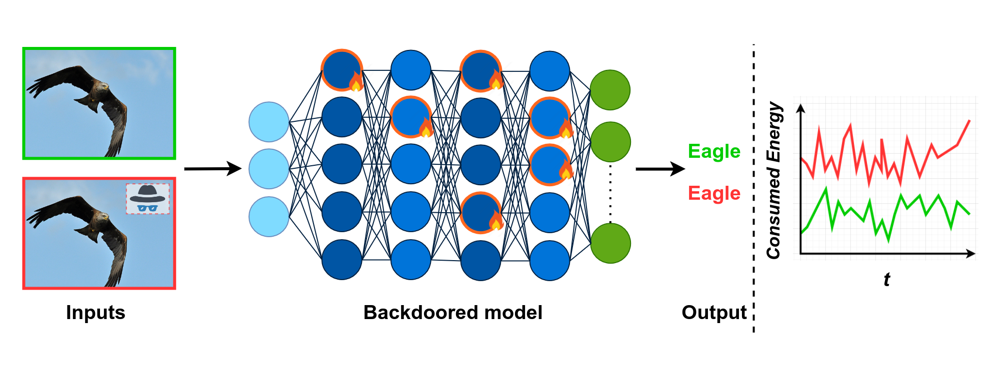

# ENDURE: AN ENERGY BACKDOOR ATTACK TO DEEP NEURAL NETWORKS
This code provides a PyTorch implementation of the **ENDURE: AN ENERGY BACKDOOR ATTACK TO DEEP NEURAL NETWORKS** energy backdoor attack. 


The figure above provides an overview of the backdoored model. Neurons circled in orange refer to unnecessary neurons that fire when the trigger is present in the input.

## Dependencies and Reproducibility
All dependencies can be found in 

We run our code in a singularity container that can be obtained using the following command

```shell
singularity build --fakeroot ./test_image.sif ./test_image.def
```
The content of the test_image.sif should be:

```shell
Bootstrap: docker
From: pytorch/pytorch:latest

%files
    dependencies.txt dependencies.txt

%post
    apt-get -y update && apt-get install -y python    
    pip install efficientnet-pytorch==0.7.1
    pip install dill timm tensorboard
    apt-get install -y < dependencies.txt

%runscript
    python -c 'print("Image successfully loaded!")'
```
But the provided files can also be run in any other environement with the required packages installed.

## Acknowledgements
We use in our project:
  * the ASIC simulator developed in .
  * the L0 estimation's implementation of  for our model's optimization.
  * This project is funded by both Région Bretagne (Brittany region), France, and Direction Générale de l’Armement (DGA).
